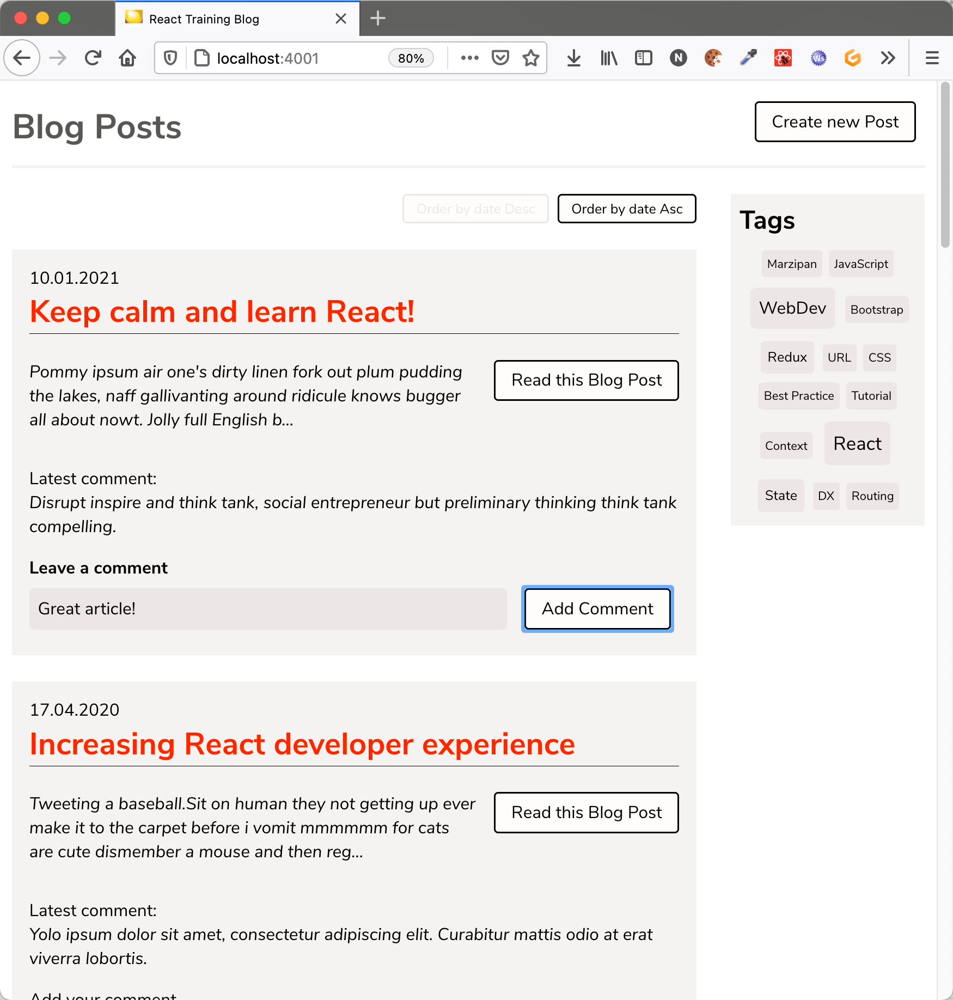

# React Server Components - Blog Example

This is an example application, showing [React Server Components](https://reactjs.org/server-components).

**Disclaimer, plase Note**: the example is mainly based on the [original React example](https://github.com/reactjs/server-components-demo). 
You won't find any other/new features here as in the original example.
The intention of this example is not build something "new" with server components, but was for me the way to better
understand the original example. So I kind of rebuilt it with a slightly different app.

The code is structured differently compared to the original one and I also added some comments to the code base (within 
source files and README files) to get a better understanding (at least for me), how things work.

Always remember: React Server Components are **unstable** and **experimental**. If you don't believe, do a 
search for "experimental" oder "unstable" in the code base 🤓

For more informations about the **original example**, please see `README-notes` in this folder.

## Start and init database

The example uses a Postgres database, that runs in a docker container. To start it, simply run:

```
cd docker
docker-compose -f docker-compose.yml up -d
```

The local port allocated by the database is **4432**, so make sure it's available.

## Run the Example app

The built and run process is almost the same as the one in the original Notes example.

You can start the server, by running:

```
npm start
```

The server runs on port **4001**, so make sure this port is also free.

## Talk on Server Components

Find my talk about Server Components here [as PDF](https://react.schule/wdc2021-server-components) (in german).

## Blog Example Application UI



Twitter: [@nilshartmann](https://twitter.com/nilshartmann)